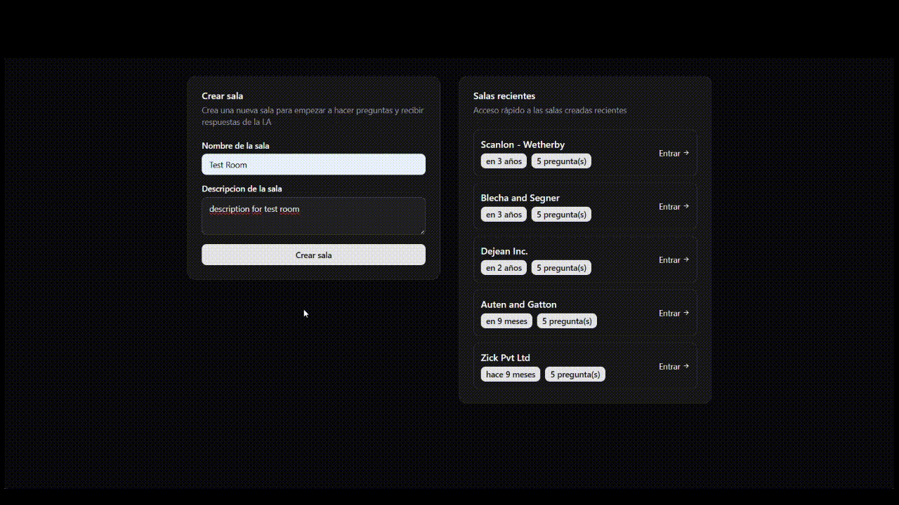

# 🤖 Let me ask - API

Let Me Ask is an AI-powered question-and-answer application where the user submits audio through the computer’s microphone. The audio content is stored in memory and used to generate responses for future questions based on that content. The system operates with independent rooms, each containing its own recorded content without mixing between them.

**⚠️ Attention!! Before follow the steps to configure, I recommend you to take a look on [Let me ask - API](https://github.com/devnestali/let-me-ask-server) to have a better experience on the web side. I hope you enjoy**

## 🤖 PROTOTYPE



## 📒 Features

- **TypeScript**: Provides static typing and modern JavaScript features for safer and scalable development.
- **Zod**: Schema validation for request inputs, ensuring data integrity in routes.
- **RadixUI**: Low-level UI component library for building accessible, customizable, and unstyled components in React.
- **React-hook-form**: Library for managing forms in React using hooks.
- **@hookform/resolvers**: Integrates validation libraries(like Zod) with React hook form.
- **@tanstack/react-query**: Data-fetching and state management library for React.
- **TailwindCSS**: Utility-first CSS framework for rapid UI development.
- **Sooner**: Toast notification library for React.
- **@biomejs/biome**: Tool for code formatting, linting, and more (alternative to Prettier/ESLint).
- **ultracite**: Managing and optimizing SVG icons (But used in this project to configure biome).
- **vite**: Fast build tool and development server for web projects.

## 📇 Main Features
- **Pages:** All the pages from the app is located here (`src/pages`).
- **Components:** Components created via RadixUI and native components for the project (`src/components`).
- **Http:** Calls to API are made here via react-query (`src/http`) and types for the request and response (`src/http/types`).
- **Libs:** External libs to handle format dates and tailwindcss merging(`src/lib`).

## 🛠️ Run the Project

- Before using this app, it's highly recommended to install the latest versions of [Node](https://nodejs.org/). Make sure to follow all the installation and configuration steps provided by their official documentation.

# 🛠️ Configuration

  - To install the node modules package, run the code bellow:
  ```bash
    npm install
  ```

  - To run the project in your machine, run the code bellow:
  ```bash
    npm run dev
  ```

## 🗂️ Key Files & Directories
- Entrypoint: `src/main.tsx`
- App & Providers: `src/app.tsx`
- Pages: `src/pages/`
- Components: `src/components/`
- API Calls: `src/http/`
- API Types: `src/http/types`
- External Libs: `src/lib/`

## 📂 Folder Structure

```
src/
  components/
    ui/
    create-room-form.tsx
    question-form.tsx
    question-item.tsx
    question-list.tsx
    room-list.tsx
  http/
    types/
    use-create-question.ts
    use-create-room.ts
    use-room-questions.ts
    use-rooms.ts
  lib/    
  pages/
  index.css
  app.tsx
  main.tsx
```

## 🚀 License

**[@devnestali]('https://github.com/devnestali') - Software Engineering and FullStack Developer**


All rights reserved by **[devnestali]('https://github.com/devnestali')**